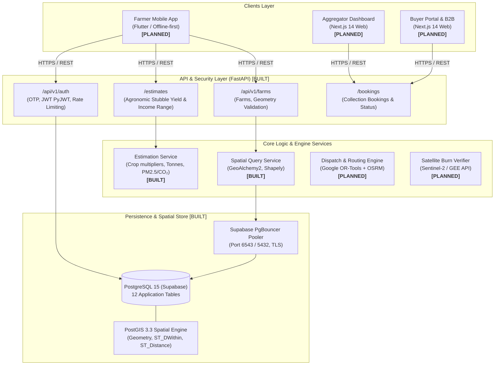

# ParaliSetu — Architecture Explained

> High-level system architecture, component breakdown, and an end-to-end request walkthrough for ParaliSetu.

---

## 1. System Architecture Diagram



---

## 2. Component Status Classification

| Layer / Component | Technology | Implementation Status | Description |
| :--- | :--- | :--- | :--- |
| **Auth API** | FastAPI, PyJWT, Passlib | **BUILT** | Phone OTP verification, token generation, 5-minute lockout on brute force, demo mode toggle (`/auth/otp/send`, `/auth/otp/verify`). |
| **Farms & Geography API** | FastAPI, GeoAlchemy2, PostGIS | **BUILT** | Register land holdings with WGS84 GPS point coordinates, area in acres, and crop varieties (`/farmers/{farmer_id}/farms`). |
| **Stubble Estimation Service** | Python (SPEC.md agronomic factors) | **BUILT** | Calculates dry stubble tonnage range (low/mid/high) and estimated income range from acreage, variety, and harvest method (`/estimates`). |
| **Relational & Spatial Database** | PostgreSQL 15 + PostGIS 3.3 | **BUILT** | 12 tables active on Supabase: `users`, `farms`, `buyers`, `machines`, `trucks`, `bookings`, `estimates`, `offers`, `payments`, `burn_checks`, `impact_log`, `weighbridge_records`. |
| **Environmental Impact & Emissions Factors** | Python (ICAR / CPCB factors) | **PLANNED** | Stored as `None` placeholders in `impact_log` model per SPEC.md §9 & §11 pending verification with published sources. |
| **Farmer Mobile Client** | Flutter / Dart | **PLANNED** | Vernacular UI (Hindi/Punjabi), offline SQLite storage, 3-step stubble pickup booking. |
| **Aggregator & Buyer Dashboards** | Next.js 14 / TypeScript | **PLANNED** | Live cluster maps, dispatch schedules, digital weighbridge slips, and escrow payment processing. |
| **Baler & Truck Dispatch Optimizer** | Google OR-Tools + OSRM | **PLANNED** | Solves vehicle routing with capacity and time windows across rural Punjab road networks. |
| **Satellite Burn Detection** | Google Earth Engine / Sentinel-2 | **PLANNED** | Post-harvest spectral verification (NDVI/NBR delta) to ensure stubble was not burnt before releasing green payments. |

---

## 3. End-to-End Request Walkthrough: Login -> Create Farm -> Estimate

This walkthrough details the exact data flow executed across the active system during a farmer's primary onboarding journey.

### Step 1: Authentication (`POST /auth/otp/send` & `POST /auth/otp/verify`) — **[BUILT]**
1. **User Action:** The farmer enters their mobile number `+919810000001` in the mobile client.
2. **API Request (`POST /auth/otp/send`):**
   - Payload: `{"phone_e164": "+919810000001"}`
   - The backend checks rate limits (`OTP_MAX_SENDS_PER_WINDOW=5`).
   - In demo mode (`DEMO_MODE=true`), stores a 6-digit mock OTP with timestamp in-memory.
3. **API Request (`POST /auth/otp/verify`):**
   - Payload: `{"phone_e164": "+919810000001", "otp": "123456"}`
   - Backend verifies OTP within 300s window. If user is new, auto-registers with role `["farmer"]`.
   - Generates signed JWT access token using `PyJWT`.
   - Response: `{"access_token": "eyJhbGciOi...", "token_type": "bearer", "role": "farmer", "user_id": "3fa85f64-..."}`

### Step 2: Register Farm Plot (`POST /farmers/{farmer_id}/farms`) — **[BUILT]**
1. **User Action:** The farmer specifies 4.0 acres of `PR-126` paddy in Bhikhiwind with GPS coordinates `(31.4519° N, 74.9272° E)`.
2. **API Request (`POST /farmers/{farmer_id}/farms`):**
   - Headers: `Authorization: Bearer <access_token>`
   - Payload:
     ```json
     {
       "name": "Bhikhiwind Plot 1",
       "area_acres": 4.0,
       "paddy_variety": "PR-126",
       "harvest_method": "combine",
       "latitude": 31.4519,
       "longitude": 74.9272,
       "khasra_number": "14//25"
     }
     ```
3. **Database Processing:**
   - FastAPI verifies token permissions (farmer himself or kisan_mitra).
   - GeoAlchemy2 converts `(longitude, latitude)` into WGS84 Point geometry (`SRID 4326`).
   - Inserts row into `farms` table with spatial index `idx_farms_location`.
   - Response:
     ```json
     {
       "id": "e4a1a011-37d4-4bb6-b6b8-6e42b26c7104",
       "farmer_id": "3fa85f64-...",
       "name": "Bhikhiwind Plot 1",
       "area_acres": 4.0,
       "paddy_variety": "PR-126",
       "harvest_method": "combine",
       "latitude": 31.4519,
       "longitude": 74.9272,
       "khasra_number": "14//25"
     }
     ```

### Step 3: Stubble Yield & Income Estimation (`POST /estimates`) — **[BUILT]**
1. **User Action:** The farmer requests an estimate with expected harvest date `2026-10-25`.
2. **API Request (`POST /estimates`):**
   - Headers: `Authorization: Bearer <access_token>`
   - Payload:
     ```json
     {
       "farm_id": "e4a1a011-37d4-4bb6-b6b8-6e42b26c7104",
       "harvest_date": "2026-10-25",
       "wheat_sow_date": "2026-11-15",
       "buyer_price_per_tonne_inr": 1200.0
     }
     ```
3. **Backend Service Calculation (`app/services/estimation.py`):**
   - Loads variety yield factor from `yield_config.yaml` (`PR-126` combine = 2.0 t/acre).
   - Calculates mid yield: $4.0 \times 2.0 = 8.0 \text{ tonnes}$.
   - Applies low/high bounds ($\pm 20\%$): low = 6.4 tonnes, high = 9.6 tonnes.
   - Calculates income range: low = ₹7,680, high = ₹11,520 (at ₹1,200/tonne).
   - Saves record to `estimates` table.
   - Response:
     ```json
     {
       "id": "89ef6722-...",
       "farm_id": "e4a1a011-37d4-4bb6-b6b8-6e42b26c7104",
       "harvest_date": "2026-10-25",
       "wheat_sow_date": "2026-11-15",
       "stubble_tonnes_low": 6.4,
       "stubble_tonnes_mid": 8.0,
       "stubble_tonnes_high": 9.6,
       "income_low_inr": 7680.0,
       "income_high_inr": 11520.0
     }
     ```
   *(Note: Avoided emissions like CO₂ and PM2.5 are **PLANNED** in `impact_log` and will be populated once official ICAR/CPCB conversion factors are verified.)*


### Subsequent Flow: Dispatch, Pickup & Verification — **[PLANNED]**
- **Step 4 (Planned):** Booking is dispatched to the nearest available baler via the Google OR-Tools optimization engine.
- **Step 5 (Planned):** Tractor driver confirms bale collection; truck passes industrial weighbridge (digital slip generated in `weighbridge_records`).
- **Step 6 (Planned):** Satellite Sentinel-2 pass verifies that zero thermal/scar anomalies exist on farm coordinates.
- **Step 7 (Planned):** Direct bank transfer (DBT) is triggered to the farmer's registered UPI/account.
